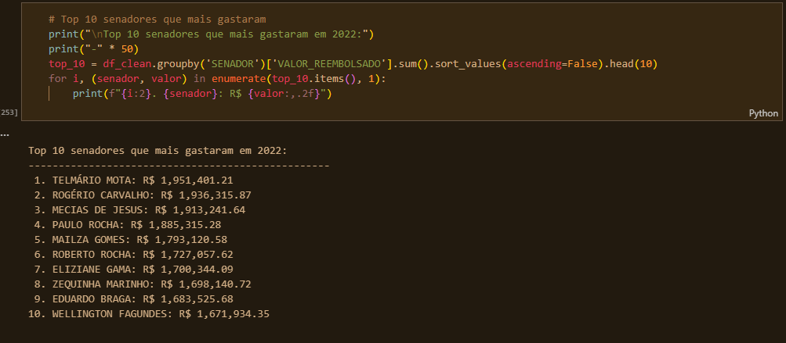
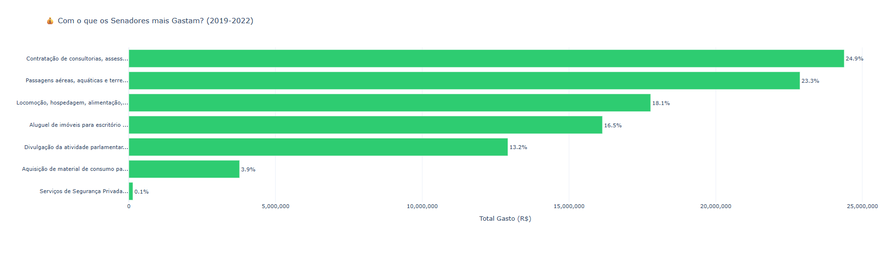
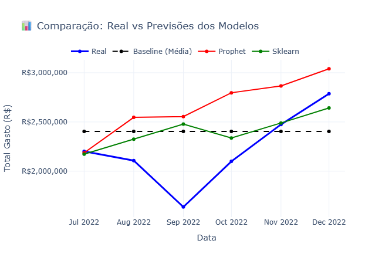
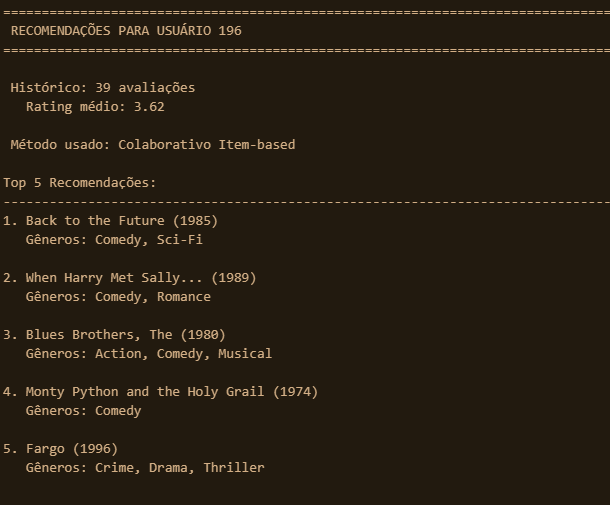
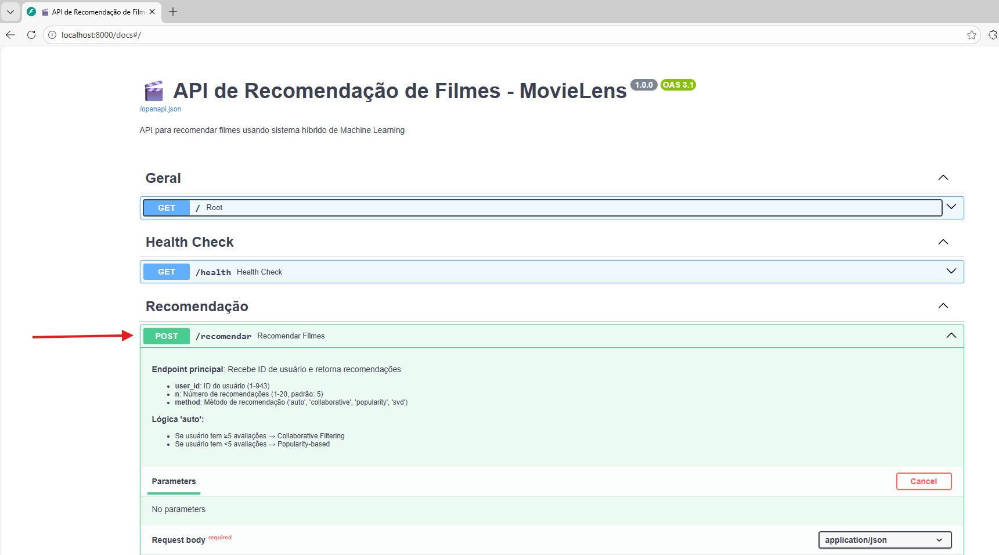
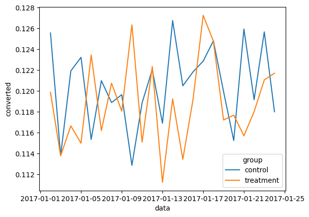

# 🎯 7 Days of Code — Data Science

Portfólio do desafio **#7DaysOfCode de Data Science** da [Alura](https://7daysofcode.io/), cobrindo o pipeline completo de ciência de dados: da limpeza de dados brutos à validação estatística de hipóteses, passando por visualização, machine learning, APIs e deploy de modelos.

**Bruno Corrêa** — Engenheiro | Especialista em Ciência de Dados

*Transformando dados em resultados.*

- 📧 Email: bfpc7@icloud.com
- 💼 LinkedIn: [linkedin.com/in/bfpc7](https://www.linkedin.com/in/bfpc7/)
- 🐙 GitHub: [github.com/Bernardinense](https://github.com/Bernardinense)

---

## Projetos

&nbsp;

### [Dia 1 — CEAPS Data Wrangling](https://github.com/Bernardinense/ceaps-data-wrangling)

*Limpeza e tratamento de 69.356 registros de despesas do Senado Federal (CEAPS 2019–2022). Correção de tipos, padronização de CNPJ/CPF, tratamento de 44% de valores ausentes e criação de novas features para análise.*

`Python` `Pandas` `NumPy`

 

---

&nbsp;

### [Dia 2 — CEAPS Storytelling](https://github.com/Bernardinense/ceaps-storytelling)

*Análise exploratória e storytelling com 5 perguntas-chave sobre os gastos dos senadores. 7 gráficos interativos e relatório consolidado com resumo executivo. Destaques: impacto da pandemia em 2020, pico de gastos em dezembro e os senadores que mais consumiram recursos.*

`Python` `Pandas` `NumPy` `Plotly`

 

---

&nbsp;

### [Dia 3 — CEAPS Forecasting](https://github.com/Bernardinense/ceaps-forecasting)

*Previsão de gastos futuros do Senado comparando 3 modelos: Baseline (média), Prophet e Regressão Linear. Surpresa: o modelo mais simples (Sklearn, MAPE 13,3%) superou o Prophet (MAPE 22,6%) — com apenas 4 anos de dados, a sazonalidade complexa não foi bem capturada.*

`Python` `Pandas` `Prophet` `Scikit-learn` `Plotly`

 

---

&nbsp;

### [Dia 4 — Movie Recommendation System](https://github.com/Bernardinense/movie-recommendation-system)

*Sistema de recomendação de filmes com MovieLens 100K. 3 abordagens implementadas: Popularidade, Filtragem Colaborativa Item-based e Matrix Factorization (TruncatedSVD). Sistema final híbrido que combina Colaborativo como principal e Popularidade como fallback para cold start.*

`Python` `Pandas` `Scikit-learn` `SciPy`

 

---

&nbsp;

### [Dia 5 — Movie Recommendation API](https://github.com/Bernardinense/movie-recommendation-api)

*API REST com FastAPI servindo o modelo de recomendação do Dia 4. 4 endpoints (raiz, health check, recomendação, estatísticas), validação com Pydantic, documentação automática via Swagger e lógica inteligente de fallback para novos usuários.*

`Python` `FastAPI` `Uvicorn` `Pydantic` `Scikit-learn`

 

---

&nbsp;

### [Dia 6 — A/B Testing & Hypothesis Validation](https://github.com/Bernardinense/ab-testing-hypothesis)

*Análise de teste A/B para validar se um sistema de recomendação melhora conversões de um e-commerce. 294 mil registros, limpeza de dados inconsistentes, amostragem e teste t bicaudal. Resultado: p-valor 0,1133 — sem evidência estatística para rejeitar H0. Recomendação: manter a página atual.*

`Python` `Pandas` `Matplotlib` `Seaborn` `SciPy`

 

---

## Tecnologias Utilizadas

| Categoria | Tecnologias |
|-----------|-------------|
| Linguagem | Python 3.13 |
| Manipulação de Dados | Pandas, NumPy |
| Visualização | Plotly, Matplotlib, Seaborn |
| Machine Learning | Scikit-learn, Prophet, SciPy |
| API | FastAPI, Uvicorn, Pydantic |
| Serialização | joblib |
| Versionamento | Git, GitHub |

---

## O que este desafio demonstra

| Competência | Dias |
|-------------|------|
| Limpeza e tratamento de dados | 1, 6 |
| Análise exploratória e storytelling | 2 |
| Previsão de séries temporais | 3 |
| Machine Learning (recomendação) | 4 |
| Deploy de modelos via API REST | 5 |
| Teste de hipóteses e estatística | 6 |

---

## Licença

Este projeto está sob a licença MIT. Veja o arquivo [LICENSE](LICENSE) para mais detalhes.